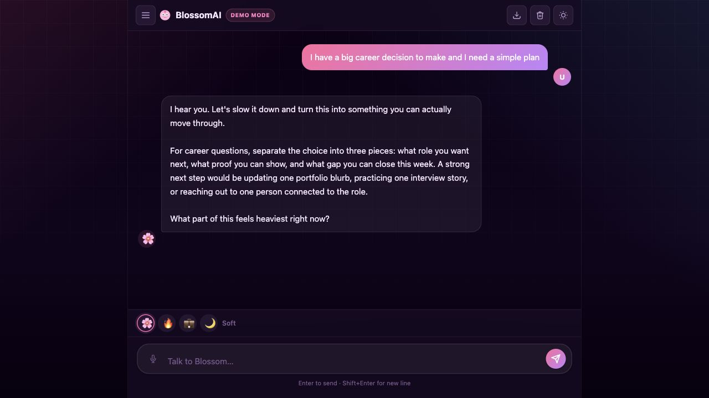

# BlossomAI

A conversational chat companion with a warm, adaptive personality. BlossomAI helps with everyday topics like career decisions, creative blocks, relationships, habit-building, money basics, and general life planning through a polished, real-time chat interface.

> **Status:** Early stage · Actively developed

Live interface demo: https://briannab1997.github.io/bb-blossom-ai/

The GitHub Pages version now includes a mock response engine, so visitors can actually test the chat experience without using a paid API key. The full API-backed version is still built for Vercel Serverless Functions and uses `OPENAI_API_KEY` when deployed with one.

## Screenshot



## Why This Project

BlossomAI is a product-focused chat interface project. I built it to practice real-time chat UX, conversation state, local session history, tone switching, export tools, responsive layout, mock/demo behavior, and serverless API structure. I wanted it to feel like something someone could open and use, even from a static portfolio link.

---

## What Blossom Can Help With

BlossomAI is designed to be a thoughtful, versatile companion. Topics include:

| Category | Examples |
|---|---|
| 💼 Career & Work | Career direction, job searches, workplace dynamics, interviews |
| 📚 School & Productivity | Study strategies, procrastination, time management, burnout |
| 💔 Relationships | Communication, boundaries, conflict, difficult people |
| 🎨 Creativity | Brainstorming, creative blocks, project ideas, writing |
| 🌱 Habits & Growth | Building routines, motivation, self-discipline, goal setting |
| 🧠 Mental Wellness | Stress, anxiety, overwhelm (with professional referral when appropriate) |
| 💰 Money & Finances | Budgeting basics, saving habits, financial decisions |
| 🎯 Decision-Making | Thinking through big choices, pros/cons, next steps |

---

## Features

- **Mock demo replies** — GitHub Pages visitors can test the chat without needing a live API
- **Streaming responses** — API-backed deployments stream tokens in real-time (SSE), like a live conversation
- **Conversation memory** — full message history is sent to the API for multi-turn context
- **4 tone modes** — switch between Soft 🌸, Sassy 🔥, Pro 💼, and Wise 🌙 at any time; the UI accent color shifts with each tone
- **Session history** — past conversations are saved locally and accessible from the sidebar
- **Voice input** — speak your message via the Web Speech API (browser permitting)
- **Export chat** — download any conversation as a `.md` file
- **Copy messages** — copy any response to clipboard with one click
- **Dark-first interface** — deep purple theme is the default, with light mode still available
- **Keyboard shortcuts** — `⌘K` clear · `⌘D` dark mode · `⌘E` export · `⌘B` sidebar
- **Mobile responsive** — works across screen sizes with reduced-motion support

---

## Tech Stack

| Layer | Tech |
|---|---|
| Frontend | Vanilla JS, HTML5, CSS3 (no framework) |
| Demo Logic | Client-side mock response engine |
| API Option | OpenAI `gpt-4o-mini` via streaming SSE |
| Backend | Vercel Serverless Functions (`/api/blossom.js`) |
| Persistence | Browser `localStorage` |
| Deployment | GitHub Pages for the mock demo; Vercel for API-backed chat |

---

## Running Locally

For the static demo, you can use any local static server:

```bash
python3 -m http.server
```

Open the local URL shown in your terminal. If the serverless API is not available, BlossomAI automatically switches into demo mode.

For the full stack version (frontend + API), use the Vercel CLI:

```bash
npm install -g vercel
vercel dev
```

Then open [http://localhost:3000](http://localhost:3000).

> **Note:** A plain static server will not run `/api/blossom`, but the mock engine keeps the chat usable for portfolio demos.

---

## Environment Variables

Set the following in your Vercel project dashboard or a local `.env` file:

| Variable | Description |
|---|---|
| `OPENAI_API_KEY` | Your OpenAI API key |

---

## Deploying to Vercel

```bash
vercel --prod
```

Make sure `OPENAI_API_KEY` is set in your Vercel project's Environment Variables before deploying.

---

## Project Structure

```
├── index.html        # App shell — layout, sidebar, hero, input
├── script.js         # All frontend logic (streaming, sessions, voice, shortcuts)
├── style.css         # Design system — CSS variables, glassmorphism, animations
├── api/
│   └── blossom.js    # Serverless function — OpenAI SSE streaming handler
├── blossomIcon.svg   # App icon
└── vercel.json       # Vercel deployment config
```
